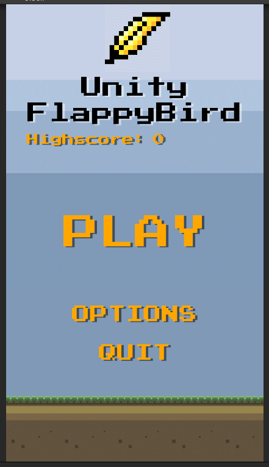

# Unity's Flappy Bird

## About

The assets and main idea behind this project are from [this great tutorial of NoobsTuts](https://noobtuts.com/unity/2d-flappy-bird-game). The aim was to improve Unity's main concepts necessary to build this game. After the tutorial, I improved the final game by:

- creating main menu;
- creating (useless) option menu;
- making randomly generated obstacles;
- adding points;
- adding free sound effects;
- adding highscore;

`Attention: Only play on portrait mode. You can use space key or touch screen to jump.`

## Screenshots

